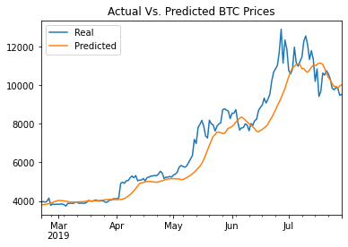
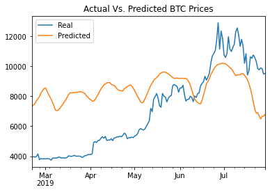

# LSTM Stock Predictor

## Background

Due to the volatility of cryptocurrency speculation, investors will often try to incorporate sentiment from social media and news articles to help guide their trading strategies. One such indicator is the [Crypto Fear and Greed Index (FNG)](https://alternative.me/crypto/fear-and-greed-index/) which attempts to use a variety of data sources to produce a daily FNG value for cryptocurrency. 

This assignment uses deep learning recurrent neural networks to model bitcoin closing prices. One model will use the FNG indicators to predict the closing price while the second model will use a window of closing prices to predict the nth closing price.

## Requirements

* Use the `pip install` command to install the `TensorFlow 2.0` module. This module also has built-in module for `Keras`

- - -

### Files

[Closing Prices Starter Notebook](./src/lstm_stock_predictor_closing.ipynb)

[FNG Starter Notebook](./src/lstm_stock_predictor_fng.ipynb)

- - -

## Approach

* Data is prepared and split into training and testing data in 70:30 ratio
* MinMaxScaler is used to scale the data to avoid underfitting
* Reshaping the data to fit the model

* Epochs = 10
* Dropout fraction = 0.2
* RNN model = Sequential
* Optimizer = "adam"
* loss = Mean Squared Error
* Batch Size = 30

- - -
Model: "sequential"
_________________________________________________________________
 Layer (type)                Output Shape              Param #   
=================================================================
 lstm (LSTM)                 (None, 10, 30)            3840      
                                                                 
 dropout (Dropout)           (None, 10, 30)            0         
                                                                 
 lstm_1 (LSTM)               (None, 10, 30)            7320      
                                                                 
 dropout_1 (Dropout)         (None, 10, 30)            0         
                                                                 
 lstm_2 (LSTM)               (None, 30)                7320      
                                                                 
 dropout_2 (Dropout)         (None, 30)                0         
                                                                 
 dense (Dense)               (None, 1)                 31        
                                                                 
=================================================================
Total params: 18,511
Trainable params: 18,511
Non-trainable params: 0
_________________________________________________________________

- - -

Window Size of 40 worked best with closing price. Loss : 0.009643105790019035
Whereas Loss error for FNG values : 0.11529483646154404